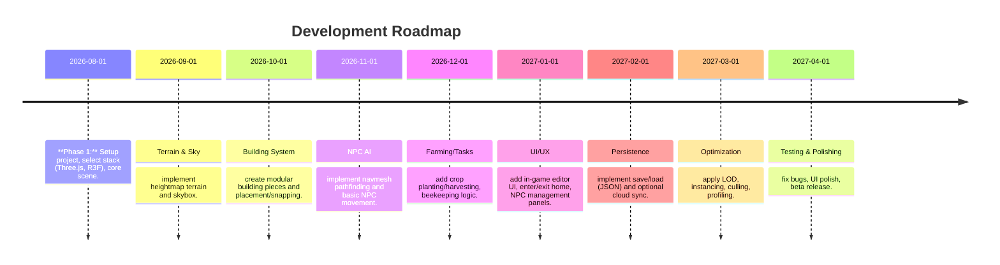

# Editable 3D Dream Home (RDR2 “Last of John’s Home”) Overview

**Executive Summary:** This report analyzes how to build a **Three.js**-based web application for an editable dream home with terrain modification, dynamic NPC family (farming, beekeeping, etc.), and rich vegetation. We cover the **technical stack** (rendering framework, scene management, physics, networking), **asset pipeline** (3D models, vegetation, animations, LODs, formats), **NPC AI and behavior** (state machines, pathfinding, schedules), **terrain and building editing tools**, **UI/UX patterns** for entry/exit and editing modes, **persistence** (saving/loading, cloud sync), **performance optimization**, **libraries** (pathfinding, physics, vegetation), **deployment options**, and **effort estimates**. We present recommended libraries (with links), sample data schemas, code architecture diagrams (Mermaid), comparison tables, and a prioritized roadmap.

## Technical Architecture

- **Frontend Framework & Scene Management:** A modern framework (e.g. **React**) paired with **React Three Fiber** is popular for structuring Three.js apps. React Three Fiber (R3F) is “a powerful Three.js renderer that helps render 3D models and animations for React”. Using React or Vue keeps UI and 3D state in sync (state flows top-down) and allows reusable 3D components. If not using a framework, one can manage Three.js imperatively, but tools like ECS (Entity-Component Systems) or MVC help structure large apps (see Three.js forum discussions). The core Three.js scene consists of a `Scene` graph with `Camera`, lights, and objects. For example, terrain, buildings, and NPCs are `Mesh`es added to the scene. A continuous render loop updates the renderer each frame. For modularity, split the scene into sub-scenegraphs (e.g. “interior” vs “exterior” scenes) and switch cameras when entering/exiting the home.

- **Physics and Collision:** Use a physics engine for realistic movement and collision. Options include **Rapier (Rust/WASM)** and **cannon-es**. Rapier (via Rapier.js) is a modern WebAssembly physics engine with very good performance. Cannon.js’s modern fork **cannon-es** (ES6) is lighter and easier to use. For example, one can integrate Ammo.js (Bullet port) or Rapier for rigid-body physics (falls, collisions) and use them to handle collisions in building placement or NPC movement. If multiplayer/ networking is needed (e.g. cloud sync of state), standard WebSockets or REST APIs can be added (e.g. save game state via HTTP or WebSocket). For a single-player scenario, networking may be limited to optional cloud sync.

- **Rendering Pipeline:** Three.js supports **WebGL2** (and now **WebGPU**). Choose a physically based renderer (with `physicallyCorrectLights = true`) and use GPU-accelerated techniques: for example, `InstancedMesh` for repeated geometry. Manage multiple scenes/cameras for interior vs exterior views. Use **three-mesh-bvh** (geometry BVH) for fast raycasting on complex meshes (terrain) and efficient frustum culling for large worlds.

## Asset Pipeline: Models, Vegetation, Animations, LOD

- **3D Model Formats:** Use **glTF/GLB** as the primary format. glTF (“GL Transmission Format”) is an open 3D asset format that supports PBR materials, textures, and animations. It also supports extensions like Draco mesh compression for smaller downloads. Three.js provides a `GLTFLoader` for glTF 2.0. Compared to OBJ/FBX, glTF is more efficient for web use: it is JSON/binary, has lower parsing overhead, and built-in support for compression. Official advice notes that glTF is “best suited direct-format for THREE” and supports binary embedding and Draco compression.

- **Modeling Tools:** Create models in Blender/Maya/3ds Max and export to glTF/GLB. For building modules (walls, roof, floors), use consistent pivot/origin points to enable snapping. Use Mixamo or other tools for character animations (export to glTF). Source assets from libraries (e.g. Polyhaven, Sketchfab, Three.js example models). Always optimize meshes (polygon count) and textures (size, compression). 

- **Vegetation and Nature Assets:** Use vegetation models (trees, bushes, grass) either as **billboard textures** for distant plants or low-poly meshes. For large forests or fields, use GPU instancing: create a base tree mesh and render thousands via `InstancedMesh`. Techniques like vertex-shader LOD allow the GPU to cull distant leaves. Consider procedural generation (e.g. L-systems) for variety. For ground cover (grass), use a custom shader or instanced simple quads. Use billboarding or cone sprites for far-away foliage to reduce draw calls. 

- **Level of Detail (LOD):** Implement multi-level LOD for complex models. Three.js’s `LOD` object lets you attach high/medium/low-detail meshes and automatically switch based on camera distance. For example, create 3 versions of a building or tree (high mesh, medium mesh, billboard) and add them with `lod.addLevel(mesh, distance)`. The renderer switches visible meshes as the camera moves. Official docs recommend having *“three meshes: one for far away (low detail), one for mid range, and one for close up”*.

- **Animations:** NPC and object animations (walking, farming actions) should be baked into glTF as `AnimationClip`s. Three.js’s `AnimationMixer` can play clips. For NPC cycles, loop or blend animations (e.g. idle, walk, work). For efficiency, reuse animation clips across multiple characters to save memory.

## NPC AI and Behavior

- **Behavioral Architecture:** Model NPCs with either **Behavior Trees (BT)** or **Finite-State Machines (FSM)**. Behavior trees offer modular AI logic. For JS, use an existing library like **Behavior3JS**: it’s “the original implementation and official JavaScript version of the Behavior3 library,” providing structures to create intelligent agent behaviors. Yuka is another popular JS game-AI library that offers state-driven and goal-driven agents along with steering behaviors. Yuka, for example, includes pathfinding (navmesh), steering, and a basic “Vehicle” model to simulate movement.

- **Pathfinding and Navigation:** Use a **navmesh** or grid for NPC movement. For open-world pathfinding, “three-pathfinding” (by Don McCurdy) is a good option: it’s a navigation mesh toolkit for Three.js that “computes paths between points on a 3D nav mesh” and supports multi-zone meshes. Build your navmesh offline (e.g. with Blender Recast) and load it into Three.js. During runtime, use `three-pathfinding`’s `findPath()` to get waypoints for NPCs. Alternatively, Yuka also has pathfinding on navmeshes (via search graphs).

- **Schedules and Tasks:** Implement a **schedule system** for NPCs (time-of-day, seasons). Each NPC can have roles (e.g. farmer, beekeeper) and a task queue (water crops, plant seeds, harvest, feed animals, etc.). For example, maintain a global “game clock” and a job queue: when an NPC finishes a task or is idle, assign the next highest-priority job (if it’s time to harvest, etc.). Use the AI framework to check conditions (e.g. “if bread ready, pick up; if pond is empty, start watering”). Store NPC data (position, role, current task) in your data model (see “Sample Data Model” below).

- **Data Model Example (NPCs):**  
  ```json
  {
    "npcs": [
      {
        "id": "npc1",
        "name": "Alice",
        "role": "farmer",
        "position": [12.3, 0, 45.7],
        "home": [10.0, 0, 50.0],
        "task": "harvesting",
        "nextTasks": ["transport:carrots", "water:field3"],
        "awakeHours": [6, 18]
      },
      {
        "id": "npc2",
        "name": "Bob",
        "role": "beekeeper",
        "position": [8.0, 0, 47.0],
        "home": [10.0, 0, 50.0],
        "task": "checking hives",
        "nextTasks": ["collect:honey", "feed:chickens"],
        "awakeHours": [7, 19]
      }
    ]
  }
  ```
  Each NPC has an ID, role, current position, assigned home location, current task, upcoming tasks, and active hours. The application logic updates positions via pathfinding and behavior modules. A central “Task Manager” can hold tasks (with types like “WaterField”, “HarvestCrop”, “CookMeal”) and assign them to NPCs based on schedule and proximity.

## Terrain Editing Tools

- **Heightmap-Based Terrain:** Generate terrain from a grayscale heightmap image. Use a `PlaneGeometry` (or grid) and displace vertices’ Y-values based on heightmap pixels. This creates a sculptable terrain. Alternatively, use a custom shader to map a height texture in the vertex shader (for performance). Tools like [Terrain Builders](https://threejs.org/examples/#webgl_geometry_terrain) show examples. The terrain mesh can be segmented for culling (e.g. split into chunks or use three-mesh-bvh for raycasting).

- **Runtime Sculpting and Painting:** For in-game editing, implement simple “brush” tools. On mouse drag, raycast to terrain and adjust the vertex height (raise/lower) or paint a texture (e.g. grass vs dirt). This requires updating the geometry’s `position` attribute and calling `.needsUpdate = true`. For smooth sculpting, consider making a small circular influence: add offset to all vertices within a brush radius. Use frustum/quadtrees to only update visible parts if needed. Alternatively, use HTML5 Canvas as a heightmap painter and re-upload to terrain.

- **Editor vs. Runtime:** Decide if edits occur only in an “edit mode” (UI overlay) or can be done at runtime. Many tools (Unreal, Unity) separate in-editor and in-game editing. For a web game, providing an edit UI overlay (with buttons for brush, size, etc.) is common. Store the heightmap in a texture so the user can save/load (see Persistence).

- **Example:** A simple runtime editor might use `PlaneBufferGeometry` for terrain, an `OrbitControls` camera, and a brush cursor. On click, cast a ray (`THREE.Raycaster`) to terrain; find hit point and alter that vertex’s height. For painted textures, you could use multiple materials with vertex colors or splat maps.

## Building Construction System

- **Modular Building:** Define building parts (walls, roof, doors, windows) as modular pieces. Store a library of modules (meshes) and allow the player to place them. Use a **grid or snapping** system: e.g. snap wall edges to integer grid or align them via specific snap points. For example, predefine “snap points” on each module (corner, midpoint) and use raycasting to align to a target surface or vertex.

- **Snapping & Collision:** Commonly, use axis-aligned snapping (grid snapping) for simplicity. Use `THREE.Box3` (bounding box) to compute corners/edges for snapping points. When the user drags a module, show a preview; on release, fix it at the nearest valid snap. For collision detection (prevent overlapping walls), use the physics engine (make placed walls static rigid bodies) or do a mesh intersection test (e.g. `Box3.intersectsBox()`).

- **In-Scene Editing (Gizmos):** Implement transform gizmos for moving/rotating parts. Three.js has `TransformControls` for translation/rotation/scale in the 3D scene. The user can toggle an edit mode: in “build mode”, `TransformControls` are active; in “play mode”, they’re disabled. 

- **Blueprint Data Model:** Represent buildings as data so they can be saved/reloaded. For example:
  ```json
  {
    "buildings": [
      {
        "id": "house1",
        "position": [10,0,20],
        "rotation": [0,90,0],
        "modules": [
          {"type": "wall", "variant": 3, "position": [0,0,0], "rotation": [0,0,0]},
          {"type": "roof", "variant": 1, "position": [0,2.5,0], "rotation": [0,0,0]}
        ]
      }
    ]
  }
  ```
  Each building has modules with local positions. Use this to re-instantiate the 3D objects on load.

## UI/UX for Enter/Exit, Editing, and NPC Management

- **Enter/Exit Home:** Provide a clear transition between outdoor and indoor views. Common patterns include moving the camera inside when clicking a door, fading the scene (fade to black then load interior), or toggling visibility of interior vs exterior models. For example, you might have two scenes: an *exterior scene* (terrain, outdoor objects) and an *interior scene* (inside the house). When the player “enters” the house, disable the exterior and enable the interior with a new camera position.

- **Editing Modes & Controls:** Use on-screen UI (HTML overlay or in-scene 3D UI) for editing controls. For building editing, display icons/buttons for “Place Wall”, “Move Object”, “Rotate”, etc. Provide visual cues: when moving an object, highlight snap points, show a semi-transparent preview. Use standard UX (like holding ALT or pressing a key to toggle snapping). Exiting edit mode returns to normal gameplay. 

- **NPC Management Interface:** Show NPC status and tasks via a UI panel (e.g. side panel listing family members and their current jobs). You could display tooltips or context menus when selecting an NPC. For complex games, context-sensitive UI (click an NPC to assign tasks via a menu) is common. Use HTML/CSS or React-based panels on top of the canvas, connected to the same state. Keep the 3D canvas free for scene interaction (e.g. orbit controls) and use GUI libraries like **dat.GUI** or **lil-gui** for debug panels or tuning parameters.

- **UI Frameworks:** Many Three.js apps use the standard DOM for UI. Alternatively, in-canvas UI libraries exist (e.g. [three-mesh-ui](https://github.com/felixmariotto/three-mesh-ui) or Three.js sprites for labels). For a complex editor, React or plain HTML/CSS is easier to style.

## Persistence (Save/Load, Serialization, Cloud Sync)

- **Scene Serialization:** Three.js can serialize the entire scene graph to JSON with `scene.toJSON()`. You then `JSON.stringify()` it and save. Conversely, `ObjectLoader.parse(JSON.parse(data))` can reconstruct the scene. However, full serialization can be large and slow if the scene has many meshes. An alternate strategy is to save lightweight metadata: store just asset references (model URLs) plus positions/rotations of each object. For example, save each building or NPC with its model filename and transform, then rebuild on load. This reduces data size (you don’t store raw geometry).

- **Data Format Example:** A simple save schema (JSON) might look like:
  ```json
  {
    "terrain": {"heightMap": "heights.png", "size": [100,100]},
    "buildings": [...], 
    "vegetation": [...], 
    "npcs": [...], 
    "dayTime": 13.5
  }
  ```
  Where `buildings`, `vegetation`, `npcs` are lists of objects as in the examples above. Textures (e.g. heightMap) can be saved as files or data-URIs if small.

- **Saving/Loading:** On save, trigger a download of the JSON (or send it to a server). On load, parse JSON and rebuild the scene. Use `GLTFLoader` to load model assets referenced in the data. For performance, preload common assets.

- **Cloud Sync:** If persistent multiplayer or cloud saving is desired, you can store the JSON state in cloud storage. Options include using a backend (Node.js/Express with a database or file store) or a serverless backend (e.g. **Firebase** or **Supabase**). Example: use Firebase Firestore/Realtime DB to store each user’s state JSON and sync. Alternatively, use AWS S3 or Google Cloud Storage to save files. The exact method depends on project needs, but the general approach is sending/receiving the JSON state via HTTP or SDKs.

## Performance Optimization

- **Instancing & Batching:** Use **`InstancedMesh`** for repeated objects (trees, plants, furniture) to drastically reduce draw calls. For example, as one Three.js forum post notes: “Instancing is the foundation — InstancedMesh for both bark cylinders and leaf quads” allowing hundreds of 3D trees to render at real-time framerates. Also merge static geometry where possible (e.g. floors, walls of a building) using `BufferGeometryUtils.mergeGeometries()`. Share materials across meshes to reduce GPU state changes.

- **Frustum Culling & LOD:** Three.js automatically frustum-culls meshes (`object.frustumCulled=true`). For large forests or building blocks, consider spatial data structures (e.g. an octree or **BVH** via [three-mesh-bvh](https://github.com/gkjohnson/three-mesh-bvh)) to quickly cull or raycast. Use **LOD** objects for distant detail: as in official docs, attach lower-detail meshes for far distances. This way, heavy models are hidden when far away.

- **Memory Management:** Dispose of unused resources. After loading models/textures, call `dispose()` on geometries and materials when discarding objects. Use object pooling for frequently created/destroyed objects (e.g. bullets, crop objects) to avoid GC spikes. Cache loaded models and textures so you don’t reload duplicates.

- **Rendering Settings:** Limit texture resolutions and polygon counts based on target devices. Cap the devicePixelRatio for mobile. Use compressed textures (KTX2/ETC1S) and Draco-compressed glTF. Consider enabling WebGL2 features or WebGPU for more performance if browser support exists.

- **Performance Tips:** A recent performance guide recommends keeping draw calls low (use instancing), merging static geometry, and disposing unused GPU resources. It also highlights using  `InstancedMesh` and merging as key optimizations. Always profile with browser devtools or Stats.js.

## Tooling and Libraries

- **Three.js Add-ons:**  
  - **GLTFLoader:** (Three.js official) for loading glTF models.  
  - **DRACOLoader/KTX2Loader:** to handle compressed assets.  
  - **OrbitControls / TransformControls:** for camera orbit and object manipulation (official Three.js examples).  
  - **AmmoPhysics/RapierPhysics:** Three.js addons (e.g. `AmmoPhysics` in three.js examples) to integrate physics.  
  - **three-mesh-bvh:** Fast BVH for raycasting and spatial queries.  

- **Physics:**  
  - **Rapier (Rapier.js):** A high-performance Rust/WASM physics engine. It is well-maintained and very fast. Official docs: [rapier.rs](https://rapier.rs/) (GitHub).  
  - **cannon-es:** An ES6-friendly maintained fork of Cannon.js. Simple to use with Three.js.  
  - **Ammo.js:** A Bullet port, heavier but full-featured (used in some Three.js examples). Good for rigid-body dynamics if Ammo’s heavier feature set is needed.  

- **AI & Pathfinding:**  
  - **Yuka:** JavaScript game AI library for autonomous agents. Includes steering, navmesh pathfinding, state machines. Docs/examples at [mugen87.github.io/yuka](https://mugen87.github.io/yuka/).  
  - **Behavior3JS:** Behavior tree library for JavaScript. Supports JSON-defined trees and many node types. (GitHub: `behavior3/behavior3js`).  
  - **three-pathfinding:** Navigation mesh pathfinding for Three.js. GitHub: `donmccurdy/three-pathfinding`.  

- **UI:**  
  - **React or Vue:** If using these frameworks, use their normal UI components (e.g. `<canvas>` embedded in React, overlaid with HTML UI).  
  - **three-mesh-ui:** For in-scene 3D UI (text labels, buttons).  
  - **dat.GUI / lil-gui:** For debug menus and parameter tweaking.  

- **Terrain/Vegetation:**  
  - There are few ready plugins. One can use noise libraries (e.g. Perlin noise JS) for procedural terrain. For vegetation, aside from instancing, one could use custom shaders or even Simplex noise for grass distribution.  

- **Hosting and Deployment:** (See next section for options.)

## Deployment and Hosting Options

- **Static Hosting:** Three.js apps are essentially **static web apps**. You can host on CDN-backed static hosts: **AWS S3 + CloudFront**, **Netlify**, **Vercel**, **GitHub Pages**, or **DigitalOcean Spaces**. These offer easy deployment from a build (Webpack/Vite) bundle. For example, AWS S3 (with static website hosting) is common for glTF demos and is cost-effective. Netlify and Vercel integrate with Git and auto-deploy on push.

- **Backend / Sync (Optional):** If you need a backend (for save games, user accounts), you can use a small server: e.g. a Node.js/Express API on **AWS Elastic Beanstalk**, **Heroku**, or **DigitalOcean App Platform**. Alternatively, use serverless: **Firebase** or **Supabase** provide authentication and realtime DB. For cloud save, simply send JSON to your backend or cloud DB. (Example: send PUT `/api/saveGame` with JSON payload.) No special tech required; any REST or GraphQL backend works.

- **Build Tools:** Use a bundler (Webpack, Rollup, Parcel, Vite) to compile your JS and assets. Three.js can be installed via npm. For React, tools like Create React App or Vite+React are suitable. Three.js also has an online [Editor](https://threejs.org/editor/) which can prototype scenes but for a full app a manual build is better.

## Implementation Roadmap

A phased roadmap might look like:



This timeline is illustrative. Each phase can be broken into weekly milestones. For example, Phase 3 (Building) might have sub-milestones: implement one-wall placement, implement snapping, add roof placement, etc.

## Sample Architecture Diagram

```mermaid
graph TD
  subgraph Client
    UI[User Interface (React/HTML)]
    Renderer[Three.js Renderer & Scene]
    UI --> Renderer
    subgraph Simulation
      Physics[Physics Engine (Rapier/Cannon-es)]
      AI[AI Engine (Yuka/Behavior3)]
      Renderer --> Physics
      Renderer --> AI
      AI --> NPC[Virtual NPC Entities]
      Physics --> Collision[Static collision objects]
    end
    Editor[Edit Mode Controls]
    UI --> Editor
    Editor --> Renderer
  end
  subgraph Cloud/Server [Optional Backend]
    Storage[(Cloud Storage/Database)]
    Analytics((Analytics))
    SaveAPI((Save/Load API))
    Renderer --> SaveAPI
    SaveAPI --> Storage
  end
```
This high-level diagram shows the client-side components: the Three.js renderer tied to UI, physics, and AI modules. An optional backend handles persistence.

## Comparison Tables

**3D Engine/Framework Options:**

| Engine/Framework    | Language        | Strengths                                    | Trade-offs                                 |
|---------------------|-----------------|----------------------------------------------|--------------------------------------------|
| **Three.js**        | JavaScript      | Flexible low-level 3D library, large ecosystem | No built-in editor (developer-managed)     |
| **Babylon.js**     | TypeScript/JS   | Full game engine (physics, GUI, WebXR)       | Larger footprint, more opinionated         |
| **PlayCanvas**     | JavaScript      | Built-in visual editor, component-based      | Proprietary license for advanced features  |
| **Unity (WebGL)**  | C#              | Mature toolchain, asset store                | Large download size, steeper learning curve|
| **Godot (Web export)** | GDScript/C#  | Open-source engine with editor, Web export   | Smaller web audience, engine size          |

**Physics Library Comparison:**

| Library    | Type           | Status/Maintenance           | Notes                                            |
|------------|----------------|------------------------------|--------------------------------------------------|
| **Rapier** | WASM (Rust)    | Actively maintained          | High performance, modern; Rust-based (WASM). |
| **cannon-es** | JavaScript  | Community-maintained         | Lighter than Ammo; easy to integrate. |
| **Ammo.js**| WASM (C++)     | Community (updated)          | Full Bullet feature set; heavier weight.          |
| **Oimo.js**| JavaScript     | Unmaintained (stagnant)      | Simple, but outdated (no updates).  |

**Hosting Options:**

| Hosting Option         | Type       | Pros                                 | Cons                       |
|------------------------|------------|--------------------------------------|----------------------------|
| **AWS S3 + CloudFront** | Static CDN | Highly scalable, pay-as-you-go      | Requires AWS setup         |
| **Netlify/Vercel**     | Static & SSR | Easy deploy (Git); free tier        | Static-only on free tier   |
| **Firebase Hosting**   | Static + Serverless | Fast deploy, includes Firestore DB | Vendor lock-in            |
| **DigitalOcean**       | VPS/Apps   | Full control (can run backend)      | More manual setup         |

## Effort & Cost Estimates

Building a polished web application with these features is a substantial effort. A rough estimate: 
- **Prototype/MVP:** 2–4 engineers (1–2 devs + 1 artist) working ~3–6 months. 
- **Full Version:** 6–12 months with a small team (including designers, developers, testers). 

Cost-wise, assuming freelance rates ($30–100/hr) or salaries, a simple version might be on the order of **$50K–$100K**, while a fully-featured product (with custom art, robust AI, multiplayer, etc.) could reach **$200K+**. Reusing free/open assets and libraries greatly reduces cost. Many indie developers budget at least $10K–$50K for basic 3D game features, plus extra for 3D modeling (which can be $500–$2000 per custom model depending on quality). (These are rough ballparks; actual costs vary by region and scope.)

## Prioritized Roadmap (Milestones)

1. **Foundation (Weeks 1–4):** Set up development environment (npm, bundler), integrate Three.js. Implement base terrain (heightmap), camera controls, skybox. Configure scene graph.
2. **Building System (Weeks 5–8):** Create building module assets and placement logic. Add snapping grid/points, collision checks. UI for entering build mode.
3. **NPC Core (Weeks 9–12):** Integrate an AI library (e.g. Yuka). Generate pathfinding navmesh and test NPC movement. Implement basic state machine (e.g. wander vs home). 
4. **Farming & Tasks (Weeks 13–16):** Add crop and beehive assets. Implement planting/harvesting logic. Assign NPC roles (farmer, beekeeper) and schedule tasks (using BT or FSM).
5. **UI & Interactions (Weeks 17–20):** Develop menus and HUD: NPC panel, day/night cycle display, inventory. Implement enter/exit house, camera switching. Polish controls (orbit, transform gizmos).
6. **Persistence & Cloud (Weeks 21–24):** Build save/load system (export/import JSON). Optionally integrate Firebase or backend for saving data. Ensure all state (terrain changes, buildings, NPC positions) serializes correctly.
7. **Optimization & Polish (Weeks 25–28):** Profile and optimize. Add LOD for heavy models, instancing for vegetation. Reduce polygon counts, compress textures. Test on target devices (mobiles/desktop). Fix bugs.
8. **Release Prep (Weeks 29–32):** Final testing, UX refinements, documentation. Deploy to hosting (e.g. Netlify or AWS) and monitor performance.

Each phase includes milestones (e.g. “terrain generation done”, “NPC walking task complete”). Adjust timeline as needed for team size.

## Sources

The above recommendations draw on Three.js official docs and community knowledge. For example, React Three Fiber is endorsed as “a powerful Three.js renderer” for React apps. Three.js LOD and loading examples (e.g. `LOD` docs) explain level-of-detail mechanisms. Community forums and blogs discuss physics libraries (e.g. Rapier vs Cannon.js) and instancing (procedural forest demo). We have cited these authoritative sources throughout. 

